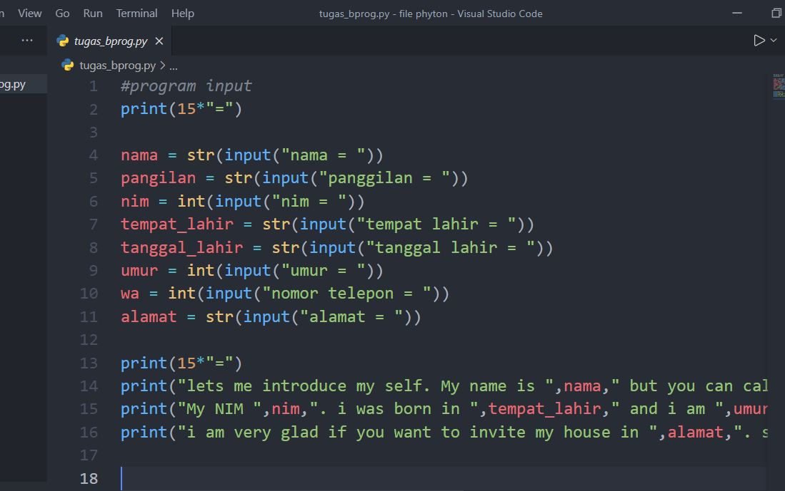

# python1
 
 Penjelasan syntax program yang saya buat

 1. (15*"=") = ini menagatakan bahwa saya memebuat tanda sama   dengan 10 kali 

2. nama, panggilan, nim, tempat lahir, tanggal lahir, umur, asal dan wa itu merukana sebuah variable

3.input = fungsi input ini untuk memasukan sebuah kata kata yang di iginkan

